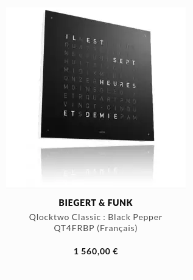
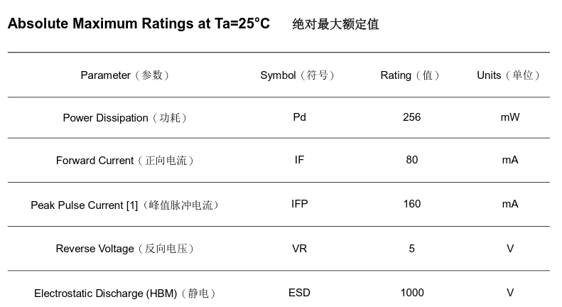
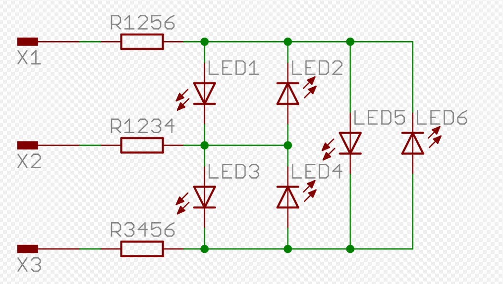
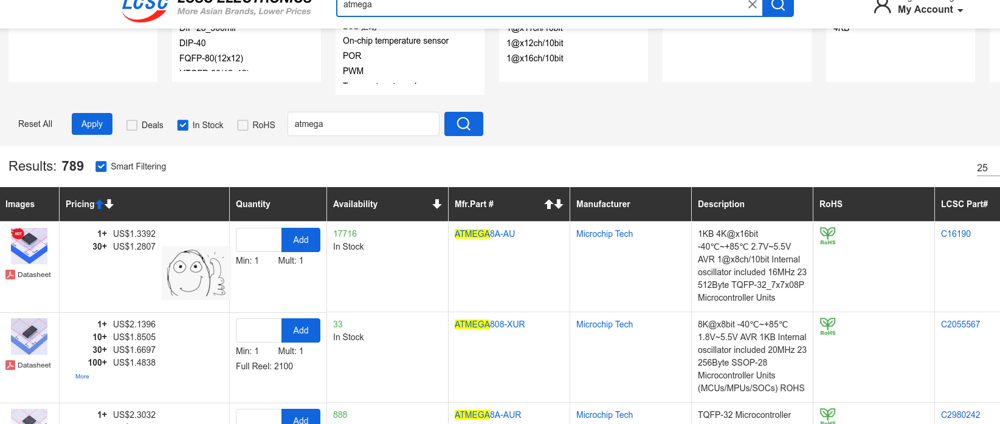
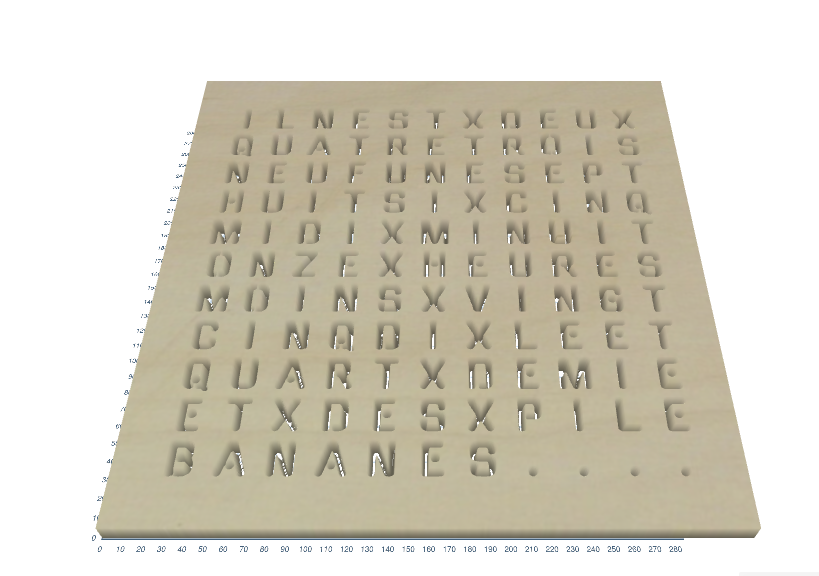
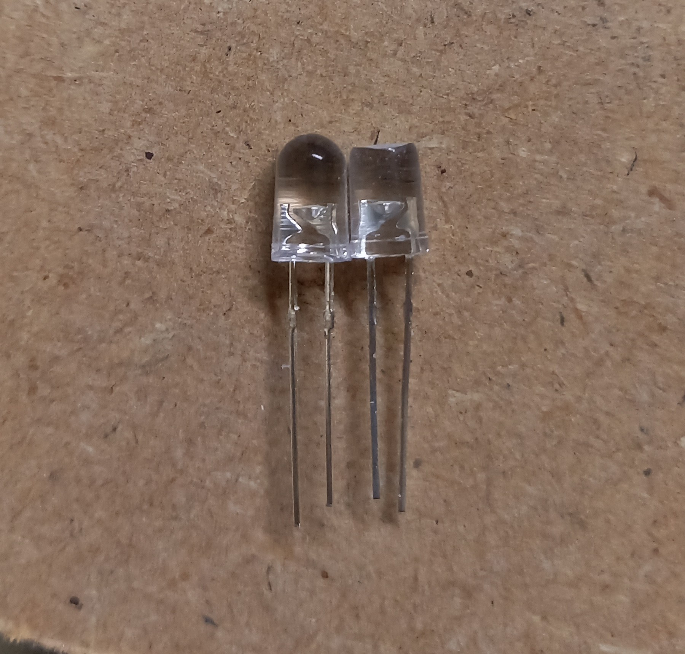

title: Horloge à mots au Secteur 3
author:
  name: Gil, Charlotte, Sebastien, Xavier
controls: false
theme: ./orange-theme
---
# Une Horloge à mots
## Les jeudis de l'electronique au secteur 3
---
# Introduction
## (5mn): Seb
---
### C'est quoi le secteur 3 et la code room ? (3mn)

- Infos utiles, qui peut venir, quels jours...
- Quelques vieux projets:

---
### Le projet : l'horloge à mots (2mn)
- Présentation, fonctionnement, tarifs commerciaux

 

- Nos objectifs : faible coût, composants simples
---
# Composants et design de la board
## (15mn) - Xav +Florent
---
### Préambule : tout ce qu'on a souhaité écarter (2mn)
- Les rubans de LEDs adressables
- Connexion Wi-Fi, mise à jour par NTP
---
### Ce qu'on doit conserver
- afficher des LEDs
- garder l'heure juste
- (éventuellement) régler l'heure
---
### La problématique de base : comment piloter XX leds ? (5mn)
  - Quand XX = 1 : 
     - courant: dans la spec
     - voltage d'une LED: dans la datasheet de la LED, ~3V pour une LED blanche. Qq mesures pour contrôler
     - contraintes d'un microcontrôleur: IO qq dizaines mA OU circuit plus complexe
     
---
### Piloter XX=30 LEDs : 1/3
  - 1 pin / LED : 30 IO
    - MCU plus chers, plus complexes à souder
    - 
    - pas possible de tout allumer en même temps sans *driver* 30\*30mA = 1 A !
  - Circuit supplémentaires 
    - 74HC595 : série -> parallèle
    - 2 pattes pour piloter toutes les LED (chaînables)
    - 8 LED / circuit : 4 circuits x 10cts ! 
    - Plus complexe a souder / réaliser plus complexe a réaliser.
---
### Piloter 30 LEDs : 2/3
  
- Multiplexage ligne/colonne: (n/2)²
- De N=30 à 2\*√N = 12 ! : 
  - MCU à 20 pattes convient
- 1 LED allumée à la fois
  - joue sur la persistence rétinienne
  - Contrôle du courant 
  - Assez rapide pour ne pas clignoter

---
### Piloter 30 LEDs : 3/3

- CharliePlex: n²-n (\~2001)
- 2 LED tête bêche, emploie le fait d'éteindre une IO    
- 6 pattes => 30 pins ! 
- beaucoup plus complexe, pas nécessaire
---
### Choix du microncontrôleur

| Quoi | Caractéristiques | Besoin |
|---|-----|----|
| CPU | 4-32 bits, 1-250 MHZ, ARM/AVR/Autre? ✖ ➗ ? | compilateur, 8/32 bits, 1MHz OK |
| RAM interne | 0 (!) à 1MB | code actuel: 1 octet |
| Flash interne | de 0k (OTP), 2Ko à 2Mo | 4Ko |
| Périphériques | 1-10+ Timers, n UART, SPI, I2C, CAN ... | Timer Quartz 32KHz |
| IO | Nb pattes (boîtier), mA | 12 GPIO, qq dizaines mA ! |
| Horloges | PLL, Osc interne / Quartz, ... | Osc. Int High speed ou PLL |
| Power | 3v3, 1v2, 5v ? | 5V plus simple, sinon 3v3|
| Programmateur | USB, UART, SWD/SPI, autre high power .. | USB, UART |

---
### Exemple de constructeurs
- Padauk: 1k OTP, 64oRAM, 3cts MAIS programmateur cher, langage pseudo-C 
- AVR Atmega328P (arduino): connu, fiable, pas cher*
- AVR Attiny : Idem, moins de mémoire, périphériques
- STM32: de 0.5€ -> qq dizaines d'euros (fait tourner linux), de 4 à 150 IOs, de 32 à 550MHz ... 
- Microchip PIC, NXP (philips), STM8, TI, Cypress, Renesas, 8051 ...
---
### Choix du microncontrôleur: choix de la famille dans la gamme constructeur

---
### Choix du microncontrôleur: choix du modèle

---
### Notre choix final
- STM32 : 
    - très large famille (64MHz, crystal, 32/8ko, 1€, 20pin)
    - simple à programmer (ARM, programmateurs très répandus, USB)
    - MCU disponibles peu chers 
- version 1 de la board
- MAIS AVR: 5V (alim directe par USB 5V), IO plus puissantes  
---
# MAIS
## Choix beaucoup plus simple !
---
### Choix sur un site connu: Atmega328P
- atmega328P (arduino), rechercher ...

- choix packages 
- click sur "in stock"
---
### Choix sur un site connu : atmega328P

---
### Choix sur un site connu : atmega328P
- Autre site ! 

---
### Algorithme V2
- Choisir un constructeur
- Sélectionner "en stock"
- Prendre le moins cher
- S'adapter
---
### Algorithme V2

- * note: les Attiny, moins puissants, ne sont pas moins chers 
---
### Comment interagir avec l'objet ? (3mn)
  - Nos idées d'interface utilisateur (PIR, boutons, mise sous tension à heure fixe...)
---
### Le schéma de la board (5mn)
  
  - explications de chaque élément 
---
### Réalisation du circuit imprimé avec EasyEDA (5mn)
  
  - Facilité de réalisation, le routage auto (démo live ?), les prix
---
### Au final

- LCPCB (china): 2 semaines, 10€ pour 15 boards
---
### Au final

---
# Partie afficheur  (13mn) - Charlotte Gil 
---
### Principe retenu pour l'assemblage en multi-couches : (5mn)
**3 Planches** 

- La première pour les lettres

  
---

- La seconde pour les mots

  

---

- La troisième pour les leds

---

**La résine**

[Résine Epodex : https://www.epodex.com/fr/produit/pro-system](https://www.epodex.com/fr/produit/pro-system/)

---

- Découpe laser vs découpe CNC, les problèmes (3mn)
  > EASEL

  

---

Comment couler de la résine (3mn)

**Etape 1 : Mettre du scotch pour contenir la résine**

**Etape 2 : Mettre la couche des mots**

---

**Etape 3 : Préparer la résine.**

- Respecter les dosages (2 pour 1)

  

- Bien remuer (5mn)

- Faire ça dans un environnement chaud 20°C

---

**Etape 4 : Couler la résine.**

**Etape 5 : Positionner les Leds**

---

**Test des différents types de LED**

- LED traversantes (30°-60°)

- LEDs cms (120°)

---
# Développement (13mn)
---
- L'environnement PlatformIO (5mn) - Florent & Seb
  > Pour ceux qui ne connaissent pas et sont restés sur Arduino
  

- Description du code, conception détaillée (3mn) - Xav + Seb
---
### Code de l'horloge

- savoir l'heure qu'il est (de façon précise)
  - un timer 32kHz piloté par le quartz
  - pré-diviser par 1024 en HW
  - lire ticks fréquemment, 
  - si valeur précédente: 
      - +1 et augmenter secondes, minutes, heures ...
- transformer les LED
  - à partir d'une minute donnée, précalculer les LED "minutes" à allumer  
  - ex: 35 -> "moins" vingt" "cinq" (et +1 heure) (attention à 23h) 
  - génère un tableau de LEDs à allumer parmi N max
- driver les LEDs
  - prégénération de tableaux minute/heure -> paquet de LEDs sur lesquelles cycler
   - certaines LEDs sont doubles: rester plus longtemps dessus
  - multiplex : boucler rapidement sur les LED 
- fonctions "avancées": réglage de l'heure, détection si quelqu'un passe, ...
  - TODO ! 
---
- Comment on (essaie (péniblement) de) (on a brillament su) faire en Rust (3mn) - Xav + ?

---
# Conclusion
## Envoyez des sioux ! (à l'arc) !
